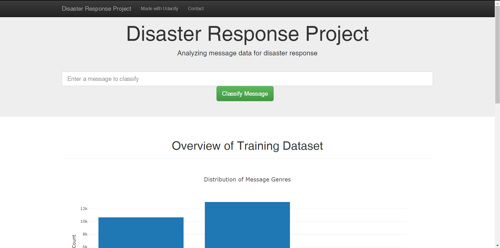
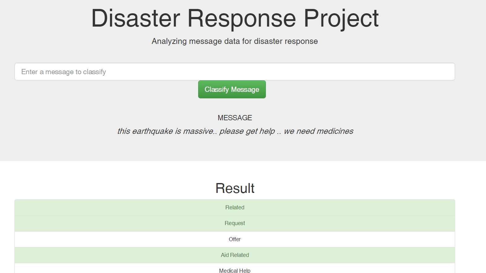
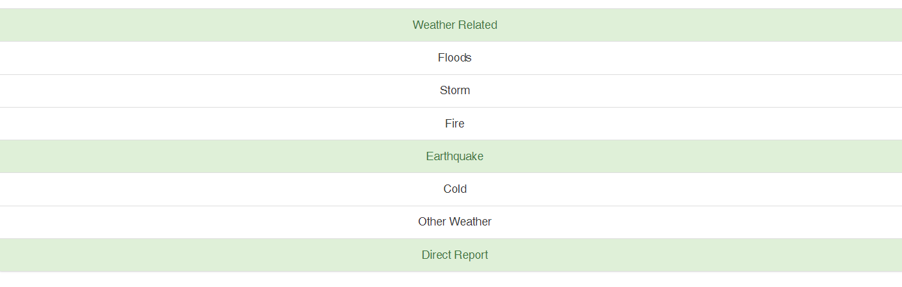
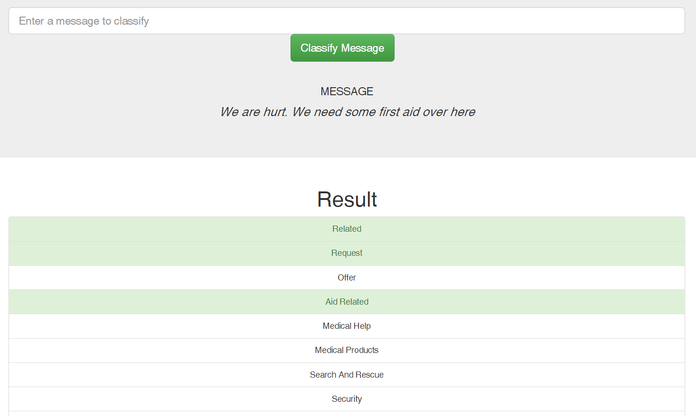
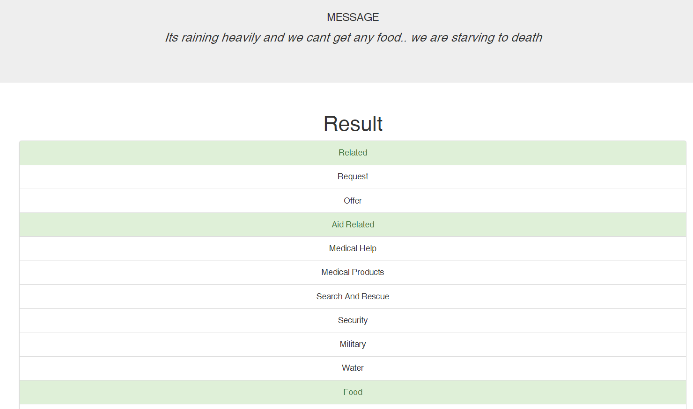

# Disaster Response Pipelines

A project with [Udacity](https://www.udacity.com/)'s Data Scientist Nanodegree in collaboration with [Figure Eight](https://appen.com/) (Appen), to build an end-to-end Extract-Transform-Load (ETL) pipeline, and a Machine Learning (ML) pipeline for classifying disaster response messages into 36 original categories. A huge shoutout to both Udacity and Figure Eight for making this wonderful and unique project happen!

## Table of Contents

1. [Description and Overview](#description)
2. [Installations](#Installations)
3. [Data & Files](#data)  
   3.1. [ETL](#ETL)  
   3.2. [ML](#ML)  
   3.3. [Flask App](#Flask)  
4. [Modelling](#Modelling)  
   4.1. [Results & Challenges](#Challenges)  
5. [Output](#Output) 
6. [Acknowledgements](#Acknowledgements)

### Description & Overview

The idea is to analyze disaster messages data, build a model to classify these messages into 36 different original categories. The process uses Machine Learning and leverages Natural Language processing, to clean and ready the textual messages data, and to create a [Multi-Output Classifier](https://scikit-learn.org/stable/modules/generated/sklearn.multioutput.MultiOutputClassifier.html) to classify the messages into 36 categories.

- The [ETL pipeline](data/process_data.py) loads in multiple files of data, merges, cleans and stores it in a SQL database.
- The [ML pipeline](models/train_classifier.py) then retrieves this database, and performs feature engineering, transformation of the features, and the actual estimation and evaluation of the classification model for the disaster data.
- The [Flask web app](app/run.py) uses HTML, python, JavaScript, CSS, to build a web app to deploy this model. This part of the project is modified from Udacity's given template.

### Installations

For the main model from scikit-learn:

    from sklearn.multioutput import MultiOutputClassifier

Use python 3.6/+.
Data Analysis/Manipulation: `pandas, numpy, matplotlib.pyplot`
Machine Learning and Natural Language Processing: `nltk, sklearn`
To save the model to never have to run again: `pickle`
To store the data in an SQL database: `sqlalchemy.create_engine`
Deployment of the app: `flask, plotly`

### Data & Files

This sections provides a brief summary of the files contained within the repository.

#### ETL

- The folder `data` contains individual `.csv` data of `messages` and `categories`.
- Contained within the same folder is `DisasterResponse.db ` database file - the one used for the Machine Learning model.
- `process_data.py` contains the entire ETL pipeline, loading `messages` and `categories`, cleaning the data and storing it in `DisasterResponse.db`.

#### ML

- `train_classifier.py` is the pipeline python script that executes the entire pipeline in the following steps: loading the database, tokenizing (cleaning) the feature vector and the target matrix, training a Grid Search model using the Multi Output Classifier, evaluating the model using Accuracy Score and F1 score for classification using a `classification_report`.
- The next step of the pipeline is to store the trained model in a pickle file - `classifier.pkl`.
- `classifier.pkl` is used in the flask app to call the model to fit new data.

#### Flask

- In the folder `app`, the subfolder `templates` contain two `.html` scripts, laying out the template for the flask app - `master.html` and `go.html`.
- The file `run.py` is used to run the app. This file calls the database file, and makes three visualizations, and calls the pickled model to basically classify new data on the app.

### Modelling

The ML Algorithm used to classify a vector of messages data into a matrix of 36 original categories is the [Multi-Target Classifier](https://scikit-learn.org/stable/modules/generated/sklearn.multioutput.MultiOutputClassifier.html) from Scikit-Learn's `sklean.multioutput.MultiOutputClassifier`.
The algorithm's performance is boosted with the `AdaBoostClassifier` and optimized using `GridSearchCV` for the optimal hyperparameters. The Multi-Output Classifier's fits one classifier per target, and is extendable to decide which algorithm it runs on, for example, Random Forest Classifier, Decision Trees, Gradient Boosting Classifiers, etc, of which I have chosen AdaBoost, with a Decision Tree base estimator.

#### Results & Challenges

_The F1 Score_ - The model used in this project yielded an **F1-Score (or _F-Measure_) of 0.63**. The F1 Score is a weighted average statistic (or a Harmonic Mean) of the _Precision and Recall_. Simply put, precision is the number of correct classifications of for example, category _Earthquake_, divided by the total number of messages classified as Earthquake, correct or not. Recall, is the number of correct classifications of earthquake, divided by the total messages that belong to earthquake (How many of the messages that were classified Earthquake, we actually Earthquake).
The overall accuracy, calculated by just the average number of times a message was categorized correctly, was 94.72% Why is there a mismatch? And why is the overall accuracy a sub-optimal measure compared to the F1 Score?

From the above image, we can understand that:

- The number of categories by count/percentage are not evenly split, and there is considerable skew.
- For the categories with lower number of messages, the classification algorithm just doesn't have enough data to train on.
- The overall accuracy is largely driven by categories with larger number of messages to train on (more the data, better the predictions).
- The F1-Score, for this reason, calculates accuracy (precision and recall) for all categories individually, and takes a weighted average, thus representing the true accuracy of the model.

Some common solutions to this unbalanced classification problem are to resample (get more data for messages for the other categories) or to try and optimize performance using a hybrid classification model, all those out of the scope of this project.
But to make things interesting for yourself, you can give this research paper a read - [GO!](http://citeseerx.ist.psu.edu/viewdoc/download?doi=10.1.1.413.3344&rep=rep1&type=pdf)

### Output

Some of the examples of how the model works is below: for the following message you can see in the image.

This model picked up on the keyword 'Earthquake' in the input message, but missed out on the medicial help requirement. But nevertheless, it picks up the essence of the message, by correctly classifying that its an aid related request, etc.  

Here is another example!  

Here is another one!!  

### Acknowledgements

Biggest thanks for Udacity and Figure Eight (Appen) for this awesome mindblowing project, which really makes use of every functioning brain cell to make things interesting and better. Also, the meaningfulness and the impact that project could potentially create is massive.
The fact that Figure Eight labelled these messages manually in order to facilitate such a project is God-level.
